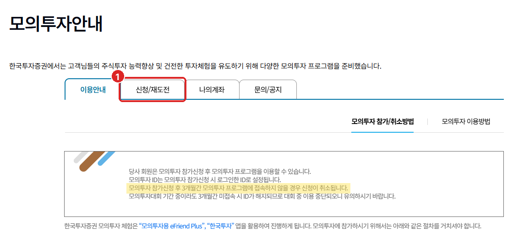
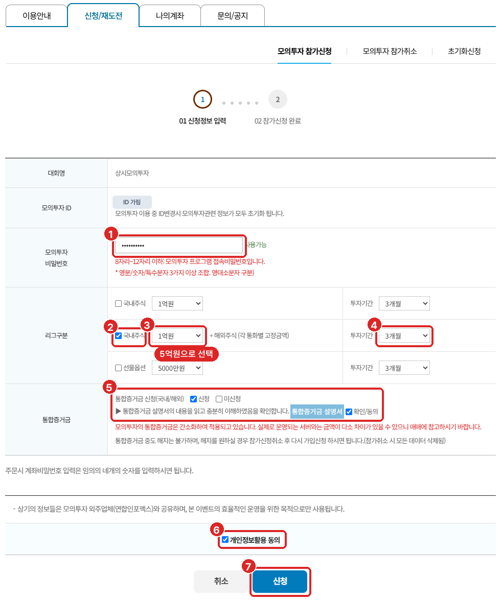
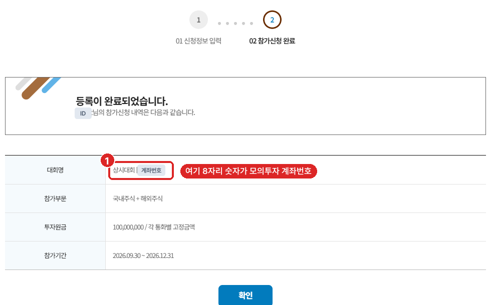
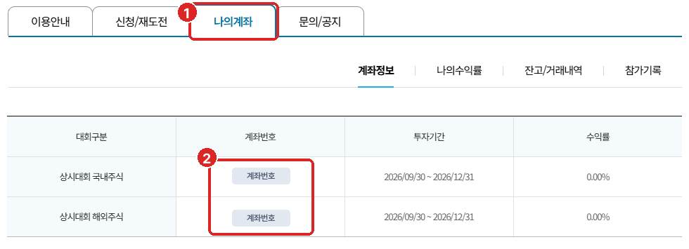
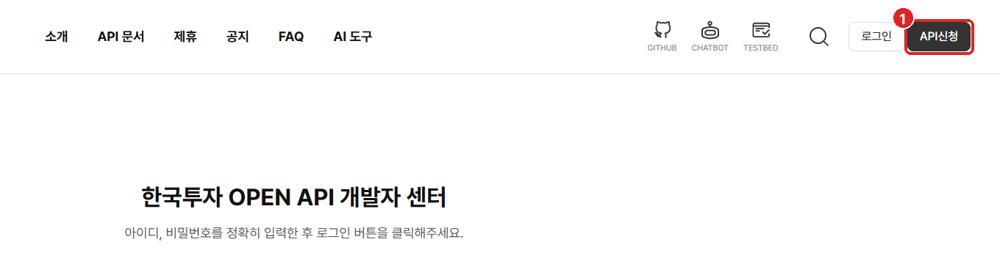
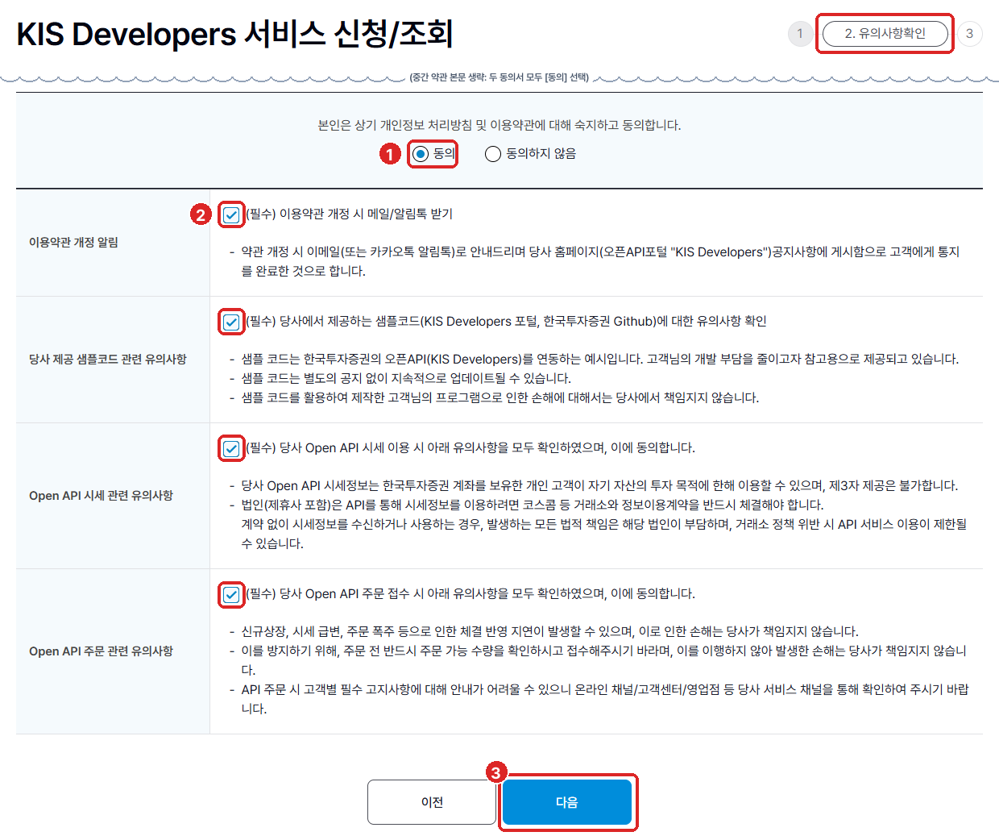
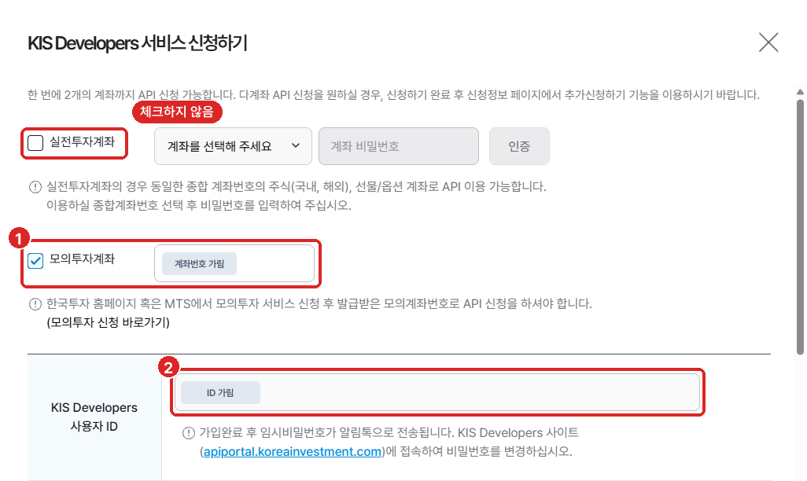
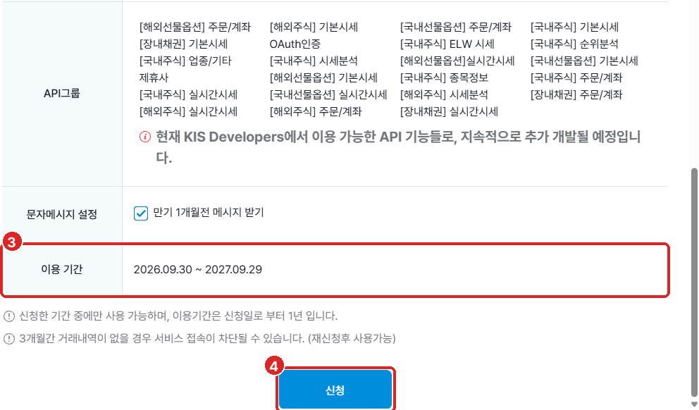
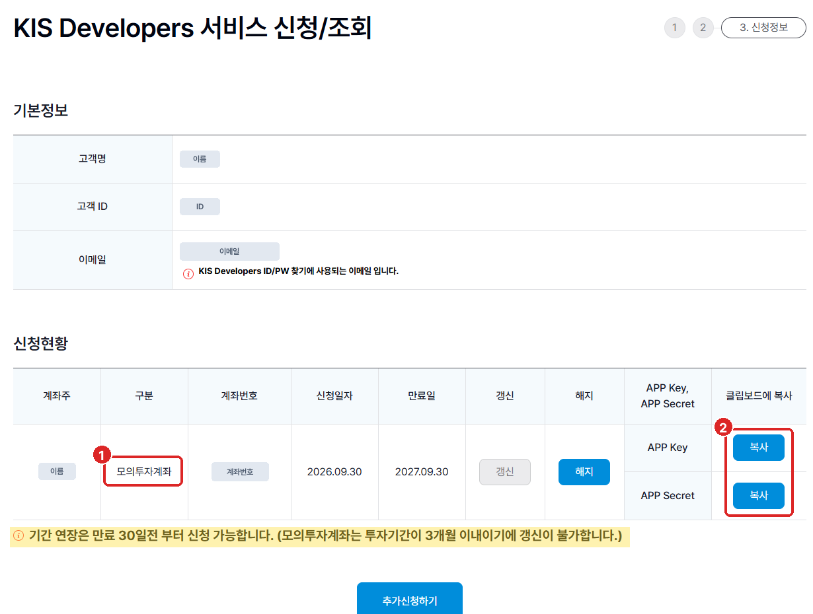

# 한국투자증권 API와 모의투자 계좌 연결하기

## 이번 클립에서 만들 것

한국투자증권 모의투자 계좌를 만들고 API 키를 받은 뒤, 내 계좌의 예수금(아직 주식을 사지 않은 현금)과 잔고를 프로그램으로 조회합니다.

> 💡 실제 돈이 아니라 가상의 돈이 들어 있는 **모의투자 계좌**로 진행하므로 금전적 위험이 없습니다.

- 화면 캡처로 따라 하는 모의투자 계좌와 API 키 발급
- 키를 코드와 떼어 `.env`에 보관하기
- **실습 15**: `kis_auth.py` 작성 및 잔고 조회

---

## 이론 핵심

### 1. 출입증을 받고, 요청마다 보여 줍니다

```text
[내 프로그램] ──> ① App Key + App Secret을 증권사에 보냄
              <── ② 24시간 쓰는 접근 토큰(출입증)을 받음
              ──> ③ 잔고·시세·주문을 요청할 때마다 출입증을 함께 보냄
```

**App Key·App Secret**은 증권사가 내 프로그램에 내주는 아이디와 비밀번호입니다.

---

### 2. 증권사에 요청을 보낼 때 알아 둘 세 가지

| 말 | 뜻 | 모의투자에서는 |
|---|---|---|
| **서버 주소** | 프로그램이 요청을 보내는 증권사 컴퓨터의 인터넷 주소 | 실전과 주소가 다릅니다. 모의투자 주소에는 `vts`가 들어갑니다 (예: `https://openapivts.koreainvestment.com:29443`) |
| **거래 코드** | 요청마다 "어떤 일을 해 달라"고 적어 보내는 기능 번호. 공식 문서에서는 `tr_id`라고 부릅니다 | 잔고·주문처럼 계좌에 관한 코드는 모의투자용이 따로 있어 `V`로 시작합니다(잔고 조회: 모의 `VTTC8434R`, 실전 `TTTC8434R`). 현재가 같은 시세 코드는 모의와 실전이 같습니다 |
| **요청 한도** | 증권사가 1초에 받아 주는 요청 수 | 계좌당 1초에 1번입니다(2026년 4월 기준). 넘기면 "초당 거래건수를 초과하였습니다" 같은 오류로 그 요청이 거절되므로, 프로그램이 요청 사이에 쉬어 갑니다 |

같은 서버 주소로 요청을 보내도, 함께 적은 거래 코드에 따라 잔고를 알려 주기도 하고 주문을 받기도 합니다. 은행 창구에서 업무 번호표를 뽑는 것과 비슷합니다.

서버 주소가 실전 쪽이면 진짜 돈이 든 계좌로 요청이 갈 수 있습니다. 그래서 우리 프로그램은 요청을 보내기 전에 주소가 모의투자 서버인지부터 확인합니다.

이 값들은 외우거나 프롬프트에 적지 않습니다. AI가 기억하는 값은 예전 것일 수 있어서(주문 코드는 2025년에 바뀌었습니다), **"공식 자료에서 확인하고 출처를 알려 달라"**고만 적습니다.

- 공식 자료: KIS Developers 첫 화면(캡처 5)의 [API 문서] 메뉴와 [GITHUB] 아이콘(공식 예제 코드)
- 내가 확인할 것: 출처가 이 두 곳인지, 서버 주소에 `vts`가 있는지, 잔고·주문 거래 코드가 `V`로 시작하는지

---

### 3. 비밀 값은 `.env`에 따로 둡니다

키를 코드에 직접 적으면, 코드를 인터넷(GitHub 등)에 올릴 때 키도 함께 공개됩니다. 그래서 키는 `.env` 파일에만 적고 코드는 실행할 때 거기서 읽어 옵니다. `.gitignore` 파일에 `.env`를 적어 두면 코드를 올릴 때 `.env`는 빠집니다.

---

## 실습 — 실습 15: KIS API 인증 및 계좌 잔고 조회

네 단계로 진행합니다. Step 1·2는 웹 브라우저에서, Step 3·4는 Claude Code에서 합니다.

<div class="step-flow">
  <div class="step-card">
    <span class="step-num">Step 1</span>
    <div class="step-body">
      <div class="step-title">모의투자 계좌 만들기</div>
      <div class="step-desc">한국투자증권 홈페이지 → 모의투자. 끝나면 <strong>모의투자 계좌번호 8자리</strong>가 생깁니다.</div>
    </div>
  </div>
  <div class="step-card">
    <span class="step-num">Step 2</span>
    <div class="step-body">
      <div class="step-title">API 키 받기</div>
      <div class="step-desc">KIS Developers 서비스 신청. 끝나면 <strong>App Key, App Secret</strong>이 생깁니다.</div>
    </div>
  </div>
  <div class="step-card verify">
    <span class="step-num">Step 3</span>
    <div class="step-body">
      <div class="step-title"><code>.env</code> 틀 만들고 값 넣기</div>
      <div class="step-desc">AI가 빈 <code>.env</code>와 각 값을 어디서 가져오는지 알려 주면, 값은 내가 직접 붙여 넣습니다.</div>
    </div>
  </div>
  <div class="step-card ai">
    <span class="step-num">Step 4</span>
    <div class="step-body">
      <div class="step-title">증권사와 연결하기</div>
      <div class="step-desc">Claude Code에 프롬프트를 넣어 내 계좌 현황을 조회합니다.</div>
    </div>
  </div>
</div>

> 💡 **준비물**: 한국투자증권 계좌와 홈페이지 로그인 ID. 없으면 '한국투자' 앱에서 비대면으로 먼저 만드세요.
>
> **화면은 바뀔 수 있습니다.** 아래 캡처는 2026년 9월 화면입니다. 메뉴 이름이나 버튼 위치가 다르면 같은 이름의 메뉴를 찾고, 그래도 안 보이면 홈페이지 검색창에 '모의투자'나 'KIS Developers'를 검색하세요. 화면이 바뀌어도 손에 쥐어야 할 것(계좌번호 8자리, App Key, App Secret)은 같습니다.

---

### Step 1. 모의투자 계좌 만들기

#### 1-1. 모의투자 신청 화면 열기

1. [한국투자증권 홈페이지](https://securities.koreainvestment.com/)에 로그인합니다.
2. 상단 메뉴 **트레이딩 → 모의투자 → 주식/선물옵션 모의투자 → 모의투자안내**로 들어갑니다. ([바로가기](https://securities.koreainvestment.com/main/research/virtual/_static/TF07da010000.jsp))
3. **① [신청/재도전]** 탭을 누르면 **모의투자 참가신청** 화면이 열립니다.

<figure class="visual-figure" markdown="1">



<figcaption><strong>[캡처 1]</strong> 모의투자안내 화면. 노란 줄: 참가신청 후 3개월간 모의투자 프로그램에 접속하지 않으면 신청이 취소됩니다.</figcaption>

</figure>

#### 1-2. 참가 신청서 채우기

캡처 2의 빨간 번호 순서대로 채웁니다. 모의투자 ID는 지금 로그인한 홈페이지 ID로 자동으로 정해집니다.

- **① 모의투자 비밀번호**: 8~12자리, 영문·숫자·특수문자 중 3가지 이상. 모의투자 프로그램(HTS: 컴퓨터에 설치하는 주식 거래 프로그램, 또는 앱)에 들어갈 때 쓰며, API 키와는 상관없습니다.
- **② 리그구분**: 가운데 줄 **국내주식 + 해외주식**에 체크. 두 대회가 계좌번호 하나로 함께 열리고, 이 강의는 국내주식 쪽을 씁니다.
- **③ 투자원금**: **5억원**. 이 교재는 모의투자 계좌에 5억 원이 들어 있다고 보고 설명합니다.
- **④ 투자기간**: **3개월**. 고를 수 있는 기간 중 가장 깁니다.
- **⑤ 통합증거금**: **신청**과 설명서 **확인/동의**에 체크. 이 강의에서는 쓰지 않으니 캡처대로 둡니다.
- **⑥ 개인정보활용 동의**에 체크하고 **⑦ [신청]**을 누릅니다.

<figure class="visual-figure" markdown="1">



<figcaption><strong>[캡처 2]</strong> 모의투자 참가신청 화면. 번호는 위 표와 같습니다. 캡처는 1억원으로 신청했지만, 여러분은 ③에서 5억원을 고르세요.</figcaption>

</figure>

> ⚠️ **투자원금과 투자기간은 신청한 뒤에 바꿀 수 없습니다.** 바꾸려면 참가를 취소하고 다시 신청해야 하니, 누르기 전에 ③ 5억원, ④ 3개월을 한 번 더 확인하세요.

#### 1-3. 모의투자 계좌번호 확인

1. [신청]을 누르면 "등록이 완료되었습니다." 화면이 나옵니다. 캡처 3의 **① 대회명** 칸, 대괄호 안 8자리 숫자가 **모의투자 계좌번호**입니다.
2. 나중에 다시 볼 때는 캡처 4처럼 **① [나의계좌]** 탭 → **계좌정보**에서 확인합니다. 국내주식·해외주식 두 줄의 계좌번호가 **② 같은 번호**입니다.

<figure class="visual-figure" markdown="1">



<figcaption><strong>[캡처 3]</strong> 참가신청 완료 화면. 이 캡처는 1억원으로 신청해서 투자원금이 100,000,000으로 보입니다.</figcaption>

</figure>

<figure class="visual-figure" markdown="1">



<figcaption><strong>[캡처 4]</strong> [나의계좌] → 계좌정보. 국내주식·해외주식 대회가 같은 계좌번호를 씁니다.</figcaption>

</figure>

계좌번호는 `50123456-01`(예시)처럼 **앞 8자리**(종합계좌번호)와 **뒤 2자리**(상품코드)로 나뉩니다. 모의투자 화면에는 앞 8자리만 나오고, 주식 계좌의 뒤 2자리는 보통 `01`입니다.

> ✅ **여기까지 되면**: [나의계좌]에 8자리 계좌번호와 투자기간이 보입니다. 이 번호는 Step 2와 Step 3에서 씁니다.

---

### Step 2. API 키 받기

**KIS Developers**는 한국투자증권 Open API(내 프로그램이 증권사 기능을 쓰게 해 주는 창구)를 안내하는 사이트입니다.

#### 2-1. API 신청 시작

1. [KIS Developers](https://apiportal.koreainvestment.com/) 오른쪽 위 **① [API신청]**을 누릅니다. 가운데 로그인 칸은 신청을 마친 뒤에 쓰는 것이라 지금은 쓰지 않습니다.
2. 한국투자증권 홈페이지의 **KIS Developers 서비스 신청/조회** 화면으로 넘어갑니다. 로그인하고 **1단계 휴대폰 인증**을 마칩니다.

<figure class="visual-figure" markdown="1">



<figcaption><strong>[캡처 5]</strong> KIS Developers 첫 화면. 오른쪽 위 [API신청]을 누릅니다.</figcaption>

</figure>

#### 2-2. 약관 동의와 신청 정보 입력

**유의사항확인** (캡처 6): **① 동의**를 고르고, **② (필수) 체크 4개**에 모두 체크한 뒤 **③ [다음]**을 누릅니다.

<figure class="visual-figure" markdown="1">



<figcaption><strong>[캡처 6]</strong> 유의사항확인 화면. 가운데 긴 약관 본문은 줄였습니다.</figcaption>

</figure>

**신청하기 창** (캡처 7·8):

- **실전투자계좌**: **체크하지 않습니다.** 진짜 돈이 든 계좌이고, 이 강의는 끝까지 모의투자만 씁니다.
- **① 모의투자계좌**: 체크하고 1-3의 8자리 계좌번호를 넣습니다.
- **② KIS Developers 사용자 ID**: 홈페이지 ID가 자동으로 보입니다. 신청을 마치면 사이트 로그인용 임시 비밀번호가 알림톡으로 오지만, 이번 실습에는 쓰지 않습니다.
- **③ 이용 기간**: 신청일부터 1년인지 확인만 하고 **④ [신청]**을 누릅니다.

<figure class="visual-figure" markdown="1">



<figcaption><strong>[캡처 7]</strong> 신청하기 창 위쪽. 실전투자계좌는 비워 두고 모의투자계좌만 체크합니다.</figcaption>

</figure>

<figure class="visual-figure" markdown="1">



<figcaption><strong>[캡처 8]</strong> 신청하기 창 아래쪽. 3개월간 거래내역이 없으면 접속이 차단될 수 있다는 안내가 있습니다.</figcaption>

</figure>

#### 2-3. App Key·App Secret 복사

1. **신청정보** 화면이 뜹니다(캡처 9). **신청현황** 표에서 **① 구분이 '모의투자계좌'**인 줄을 찾습니다.
2. 그 줄의 **② [복사]** 버튼(APP Key, APP Secret 각각)으로 값을 복사해 Step 3에서 `.env`에 붙여 넣습니다.

<figure class="visual-figure" markdown="1">



<figcaption><strong>[캡처 9]</strong> 신청정보 화면. 키 값은 화면에 보이지 않고 [복사] 버튼으로만 가져옵니다. 노란 줄: 모의투자계좌는 기간 갱신이 안 됩니다.</figcaption>

</figure>

> ⚠️ 복사한 키는 `.env` 말고 다른 곳(메신저, 메모 앱, AI 채팅창)에 붙여 넣지 마세요. 다시 필요하면 신청/조회 화면에서 다시 복사하면 됩니다.

> ✅ **여기까지 되면**: 신청현황 표에 **구분 = 모의투자계좌**, **계좌번호 = 1-3의 8자리**인 줄이 있습니다.

---

### Step 3. `.env` 틀 만들고 값 넣기

먼저 AI에게 연결에 어떤 값이 필요한지 알아보고, 그 값을 적을 `.env` 틀을 만들어 달라고 합니다. 어떤 항목이 필요한지는 몰라도 됩니다.

```prompt
[맥락] 한국투자증권 Open API로 내 모의투자 계좌를 프로그램과 연결하려고 해. 비밀번호 같은 값은 코드에 적지 않고 작업 폴더의 .env 파일에 따로 두고 싶어. 아직 어떤 값이 필요한지는 몰라.

[만들 것]
1. 모의투자 계좌를 연결하는 데 어떤 값이 필요한지 KIS Developers 문서나 한국투자증권 공식 GitHub 예제(koreainvestment/open-trading-api)에서 확인해줘.
2. 그 값들을 적을 .env 틀을 작업 폴더에 만들어줘. 값은 비워 두고, 항목마다 무엇을 적는 칸인지 한 줄 설명을 달아줘.
3. 이 계좌가 모의투자 계좌라는 것을 내가 직접 표시해 두는 항목도 하나 넣고 True로 채워 둬. 나중에 이 값이 True가 아니면 프로그램이 증권사에 아무것도 보내지 않게 할 거야.
4. 각 값을 한국투자증권 홈페이지나 KIS Developers의 어디에서 가져오는지 표로 알려줘.
5. .gitignore에 .env를 넣어, 코드를 인터넷에 올릴 때 .env가 빠지게 해줘.

[하지 말 것]
- 값을 지어내서 채우지 마.
- 값을 대화창에 붙여 넣으라고 하지 마. 값은 내가 파일에 직접 넣는다.

[확인] 만든 .env의 항목과 설명, 값을 가져올 곳 표를 보여 주고, .gitignore에 .env가 들어갔는지 보여줘.
```

AI가 만든 `.env`를 VS Code에서 열고, Step 1의 계좌번호와 Step 2에서 복사한 키를 **내 손으로** 붙여 넣어 저장합니다. 채팅창에 붙여 넣으면 대화 기록에 남기 때문입니다. 다 채우면 대략 이런 모양입니다. 항목 이름은 AI가 정해서 조금 다를 수 있습니다.

```env
# Step 2에서 복사한 App Key와 App Secret
KIS_APP_KEY=PSxxxxxxxxxxxxxxxxxxxxxxxxxxxxxxxxxxxx
KIS_APP_SECRET=xxxxxxxxxxxxxxxxxxxxxxxxxxxxxxxxxxxxxxxxxxxxxxxxxxxxxxxx
# 모의투자 계좌번호 앞 8자리와 뒤 2자리(보통 01)
KIS_CANO=50123456
KIS_ACNT_PRDT_CD=01
# 모의투자 계좌라는 내 표시. True가 아니면 프로그램이 요청을 보내지 않음
KIS_IS_PAPER=True
```

**모의투자 표시(위 예에서는 `KIS_IS_PAPER`)는 안전장치입니다.** `True`일 때만 요청이 나가고, `False`이거나 비어 있으면 프로그램은 증권사에 아무것도 보내지 않고 멈춥니다. `False`로 바꾼다고 실전 계좌로 넘어가는 길은 처음부터 만들지 않습니다. 파일 한 줄로 진짜 돈이 오가게 되면 안전장치가 아니라 스위치이기 때문입니다. 실전 전환은 모의투자로 충분히 검증한 뒤, 실전 키를 따로 받아 별도 단계로 합니다.

---

### Step 4. 증권사와 연결하기

`.env`를 채웠으면 아래 프롬프트를 입력하세요.

```prompt
[맥락] 한국투자증권 모의투자 계좌를 내 프로그램과 연결하고 싶어. 키와 계좌번호는 작업 폴더의 .env에 내가 채워 두었어. 앞으로 시세를 받고 주문을 내는 프로그램들도 이 연결을 같이 쓸 거야.

[만들 것] 파이썬 스크립트 'kis_auth.py'를 만들고 실행해줘:
1. 연결이 제대로 됐는지 알 수 있게, 내 모의투자 계좌에 지금 현금과 주식이 얼마 있는지 보여줘.
2. 뒤에 만들 프로그램들도 이 파일을 가져다 증권사와 주고받을 거야. 증권사로 가는 요청은 모두 이 파일을 거치게 하고, 그 안에서 두 가지 안전장치가 늘 작동하게 해줘. 하나는 .env의 모의투자 표시가 True이고 요청이 모의투자 서버로 갈 때만 보내는 것이야. 다른 하나는 증권사가 1초에 받아 주는 요청 수(요청 한도)를 넘겨 거절당하지 않도록 요청 사이에 간격을 두는 것이야.
3. 모의투자 표시가 실수로 True가 아니게 되면(예: False) 증권사에 아무것도 보내지 않고 멈춰야 해. .env는 고치지 말고 그런 상황을 흉내 내 실행해서, 정말 아무것도 보내지 않고 멈추는지 보여줘.

[하지 말 것]
- 서버 주소(요청을 보내는 증권사 컴퓨터의 인터넷 주소), 요청 한도, 기능마다 쓰는 거래 코드를 기억으로 채우지 마. KIS Developers 문서나 한국투자증권 공식 GitHub 예제(koreainvestment/open-trading-api)에서 확인해. 모의투자와 실전은 주소와 코드가 달라.
- .env를 고치거나 내용을 화면에 보여주지 마. 키와 계좌번호를 코드에 적지도 마.
- 실전 계좌로 무언가를 보내는 기능은 만들지 마.
- 연결이나 조회에 실패하면 숫자를 지어내지 말고 에러를 그대로 보여줘.

[확인] 내 계좌 현황과, 무엇을 어디서 확인했는지(서버 주소, 요청 한도, 거래 코드, 출처)를 표로 보여줘.
```

---

### 내 눈으로 확인할 체크리스트

- [ ] `.env`의 값은 내가 직접 넣었고, 대화창에 App Key·App Secret이 나오지 않았다.
- [ ] 내 모의투자 계좌의 현금과 주식 현황이 나왔고, 모의투자 표시가 `True`가 아닐 때는 아무것도 보내지 않았다.
- [ ] AI가 쓴 서버 주소와 거래 코드의 출처가 KIS Developers 문서나 공식 GitHub 예제였다.

---

## 다음 클립 예고

증권사 계좌와 연결되었습니다.  
다음 클립에서는 증권사에서 **지금 가격을 받아 오고, 신호에 쓰는 날짜별 가격도 증권사에서 받도록** 바꿔 보겠습니다.
