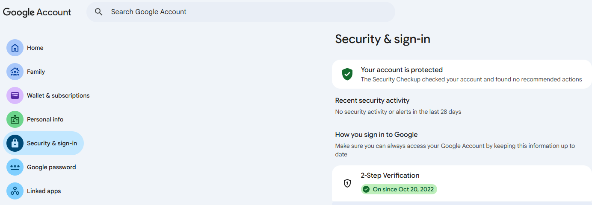
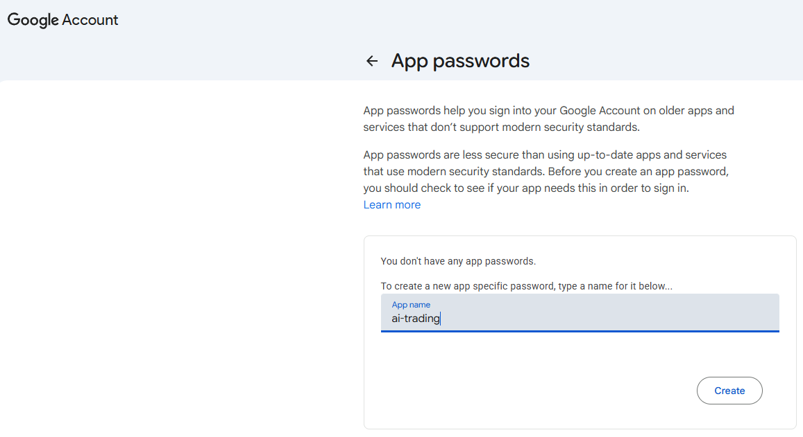

# 이메일로 매매 알림 받아보기

## 이번 클립에서 만들 것

거래가 일어났을 때 **무엇을 왜 사고팔았는지** 설명하는 메일을 보내는 알림 모듈(`notifier.py`)을 만듭니다. 거래는 신호가 바뀌는 날에만 생기므로, 과거의 하루를 가상으로 돌려 메일을 받아 봅니다.

> 💡 증권사 앱도 체결 알림을 보내 주지만 "무엇을 얼마에"까지만 알려 줍니다. 우리 메일은 "어느 전략의 어떤 판단 때문에"를 함께 보여 줍니다. 메일로는 승인할 수 없고, 매수 승인은 주문 목록 파일에서 합니다.

- 거래 이유를 담은 메일
- 실제 운용에서는 누가 언제 메일을 보내나
- **실습 20**: `notifier.py` 작성, 과거의 하루를 가상으로 돌려 메일 받기

---

## 이론 핵심

### 1. 메일에 "왜"를 담습니다

```text
[매매] 개장 주문 2건 체결                       (예시)
하나금융지주  5주 매도
KB금융        3주 매수
왜: 페어 스위칭. 전날 종가 기준 Z가 -1.5 아래로 내려가 뒤처진 KB금융으로 교체
```

"왜"는 신호 파일에 이미 적혀 있는 바뀐 이유와 판단값을 옮겨 적은 것입니다. 메일은 세 가지입니다.

| 메일 | 보내는 때 |
|---|---|
| **매매** | 개장 주문이 체결된 뒤. 무엇을 얼마에, 왜 |
| **안전장치** | 하루 손실 한도에 닿아 모두 팔았을 때 |
| **오류** | 프로그램이 멈췄을 때 |

---

### 2. 실제 운용에서는 누가 메일을 보내나

메일은 내가 보내는 것이 아니라 **프로그램이 일을 마친 뒤 스스로** 보냅니다.

| 메일 | 보내는 프로그램 | 언제 |
|---|---|---|
| 매매 | 주문 프로그램(`execute_orders.py`) | 개장 주문의 체결을 확인한 직후 |
| 안전장치 | 장중 안전장치(다음 클립에서 만듦) | 손실 한도에 닿아 팔았을 때 |
| 오류 | 멈춘 프로그램 | 멈추는 순간 |

이 프로그램들은 뒤에서 장 운영 시간에 맞춰 자동으로 돌아가게 만듭니다. 그러면 나는 메일을 받기만 합니다. 이번 클립에서는 알림 모듈을 만들고 주문 프로그램에 붙이는 것까지 하고, 메일이 실제로 어떻게 오는지는 과거의 하루를 가상으로 돌려 확인합니다. 가상 실행은 증권사에 연결하지 않고 가격 파일만 쓰며, 결과는 `logs/replay` 폴더에만 남습니다.

---

### 3. 메일 설정

프로그램은 **SMTP**(메일을 보낼 때 쓰는 표준 규칙)로 메일을 보냅니다. 필요한 값은 다섯 개이고, 증권사 연결 때 만든 `.env` 파일 맨 아래에 이어서 적습니다.

| 값 | 뜻 | Gmail이면 |
|---|---|---|
| `SMTP_HOST` | 메일을 보내 주는 서버 주소 | `smtp.gmail.com` (정해진 값) |
| `SMTP_PORT` | 접속 번호 | `587` (정해진 값) |
| `SMTP_USER` | 보내는 메일 주소 | 내 Gmail 주소 |
| `SMTP_PASSWORD` | **앱 비밀번호** | 아래 순서로 발급받은 16자리 |
| `ALERT_TO` | 알림을 받을 주소 | 내가 자주 보는 메일 주소. 보내는 주소와 같아도 됨 |

**앱 비밀번호 발급 (Gmail)** — 평소 로그인 비밀번호가 아니라, 메일 서비스가 프로그램용으로 따로 내주는 비밀번호입니다.

1. 브라우저에서 [Google 계정](https://myaccount.google.com)에 로그인하고 왼쪽 메뉴 **보안(Security & sign-in)**으로 갑니다.
2. **2단계 인증(2-Step Verification)**이 켜져 있는지 확인합니다. 꺼져 있으면 먼저 켭니다. 앱 비밀번호는 2단계 인증이 켜진 계정에서만 만들 수 있습니다.

<figure class="visual-figure" markdown="1">



<figcaption><strong>[캡처 1]</strong> 보안 화면. 2-Step Verification이 켜져 있으면(On) 다음으로 갑니다.</figcaption>

</figure>

3. [앱 비밀번호 페이지](https://myaccount.google.com/apppasswords)로 갑니다. 안 열리면 계정 페이지 맨 위 검색창에 "앱 비밀번호"를 쳐서 찾습니다.
4. 앱 이름 칸에 `ai-trading`처럼 알아볼 이름을 적고 **만들기(Create)**를 누릅니다.

<figure class="visual-figure" markdown="1">



<figcaption><strong>[캡처 2]</strong> 앱 비밀번호 페이지. 이름을 적고 Create를 누르면 16자리 비밀번호가 한 번만 표시됩니다.</figcaption>

</figure>

5. 16자리 비밀번호가 **한 번만** 표시됩니다. 네 글자씩 띄어 보이지만 띄어쓰기는 보기 편하라고 넣은 것이니, `.env`에는 **띄어쓰기 없이** 붙여 적습니다. 창을 닫으면 다시 볼 수 없으니 바로 복사합니다. 잃어버리면 지우고 새로 만들면 됩니다.

회사나 학교 Google 계정은 관리자가 앱 비밀번호를 막아 둔 경우가 있습니다. 그때는 개인 Gmail을 쓰세요. 네이버 메일이면 `smtp.naver.com`, `587`을 쓰고, 메일 **환경설정 → POP3/IMAP 설정**에서 SMTP 사용을 켭니다.

**`.env`에 붙여 넣기** — 아래를 그대로 복사해 `.env` 맨 아래에 붙여 넣고, 세 값(`SMTP_USER`, `SMTP_PASSWORD`, `ALERT_TO`)만 내 것으로 바꿉니다. `=` 양옆에 띄어쓰기를 두지 않고 따옴표도 쓰지 않습니다.

```env
SMTP_HOST=smtp.gmail.com
SMTP_PORT=587
SMTP_USER=내주소@gmail.com
SMTP_PASSWORD=앱비밀번호16자리를띄어쓰기없이
ALERT_TO=알림받을주소@gmail.com
```

> ⚠️ 평소 로그인 비밀번호를 `.env`에 적지 마세요. 앱 비밀번호는 채팅창이나 화면 공유에 노출됐다면 Google 계정에서 지우고 새로 만듭니다.

---

## 실습 — 실습 20: 이메일 알림 모듈 만들기

Claude Code 대화창에 아래 프롬프트를 입력하세요.

> 📁 **공유 파일**: 이 프롬프트는 `.env`의 메일 설정과 `price_cache` 폴더의 가격 파일을 쓰고, `execute_orders.py`에 매매 메일을 보내는 부분을 덧붙입니다. 가상 실행의 결과는 `logs/replay` 폴더에만 남고, 보낸 메일은 `logs/alerts.log`에 남습니다.

```prompt
[맥락] 거래가 일어났을 때 무엇을 왜 사고팔았는지 설명하는 메일 알림을 만들고 싶어. 메일 설정은 작업 폴더의 .env에 있어. 거래는 신호가 바뀌는 날에만 생기니, 과거의 하루를 가상으로 돌려 메일을 받아 볼 거야. 작업 폴더의 generate_signals.py(신호 계산), execute_orders.py(주문 보내기), 'price_cache' 폴더의 가격 파일을 쓴다.

[만들 것]
1. 'notifier.py': .env의 SMTP_HOST, SMTP_PORT, SMTP_USER, SMTP_PASSWORD(앱 비밀번호), ALERT_TO로 메일을 보내는 기능을 만들어줘. 메일 종류는 '매매', '안전장치', '오류'이고 제목 앞에 [종류]를 붙여. 보낸 메일은 'logs/alerts.log'에 남겨.
2. '매매' 메일 본문: 주문마다 [종목, 매수/매도, 수량, 체결 가격]과 '왜'를 적어줘. '왜'는 그날 신호 파일에서 그 종목을 움직인 전략, 바뀐 이유, 판단에 쓴 값을 찾아 한두 줄로 써.
3. execute_orders.py가 체결을 확인한 뒤 '매매' 메일을 보내게 덧붙여줘. 메일이 실패해도 주문과 기록에는 영향이 없게 해.
4. 'replay_day.py': 날짜를 주면 증권사에 연결하지 않고 그날을 가상으로 돌려줘. 그날 종가로 신호를 계산하고, 전 거래일 목표 수량을 가상 보유로 삼아 주문 목록을 만들고, 매수는 승인된 것으로 쳐서 다음 거래일 시가로 가상 체결한 뒤 [가상]을 붙인 '매매' 메일을 보내. 주문 목록과 체결 기록은 'logs/replay' 폴더에만 남겨.
5. 가격 파일 기간 안에서 전략 신호가 바뀐 가장 최근 날을 찾아 가상으로 돌리고, 메일을 보내줘.

[하지 말 것]
- 가상 실행에서 증권사에 요청을 보내거나, 실제 파일(signals.json, 실제 주문 목록, orders_history.json)을 만들거나 고치지 마.
- 비밀번호와 .env 값을 어디에도 출력하지 말고 .env를 고치지 마. 메일로 승인을 받는 기능도 넣지 마.
- 메일 전송이 실패해도 프로그램을 멈추지 마. 실패는 기록만 남겨.

[확인] 가상으로 돌린 날짜, 그날의 가상 주문과 체결, 메일 전송 결과를 보여줘. 받은편지함은 내가 확인한다.
```

---

### 내 눈으로 확인할 체크리스트

- [ ] [가상] 매매 메일에 무엇을 얼마에 사고팔았는지와 그 이유(전략과 판단 근거)가 함께 들어 있다.
- [ ] 실제 주문 목록과 `orders_history.json`은 바뀌지 않았다.

---

## 다음 클립 예고

프로그램이 한 일을 이메일로 보고받을 수 있게 되었습니다.  
하지만 들고 있는 종목이 장중에 갑자기 급락한다면 어떻게 해야 할까요? 사람이 보고 판단할 시간이 없을 수 있습니다.  
다음 클립에서는 **사람의 응답을 기다리지 않고 기준에 닿으면 바로 움직이는 자동 위험 관리 장치**를 만들어 보겠습니다.
